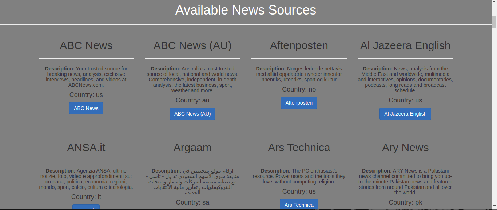
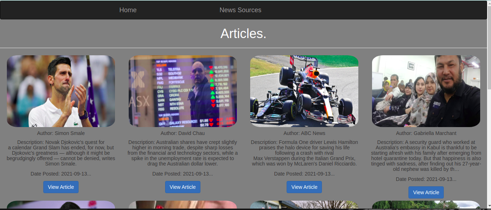

# News Catch Up
A Python Web App that allows a user to catch up on news they might have missed and browse the by their sources.

## Description.
This is a Ptython built web app that provides a list of news sources to the user to choose from and thereafter browse through news articles available in that source. The application further allows the user to choose from the specific article and read further on it.

## Author & Contact Information.
This web app was created by Kevin Kipyegon. If you have any suggestions or improvements you can reach the author via mail at kevin.kipyegon@student.moringaschool.com

## Technologies Used
1. Python
2. Flask
3. Heroku - Deployment
4. HTML
5. CSS/Bootstrap

## Installation
<li>Clone the Repository
<ul> - git clone: https://github.com/kevaf/NewsCatchUp.git  
- cd NewsCatchUp  
- Open with desired code editor(Recommended VS Code)  
- Run: chmod a+x start.sh  
- Run: ./start.py

## ScreenShot.

## Liscence.
This is an open source project avaiable under the [MIT Liscence](LISCENCE).
